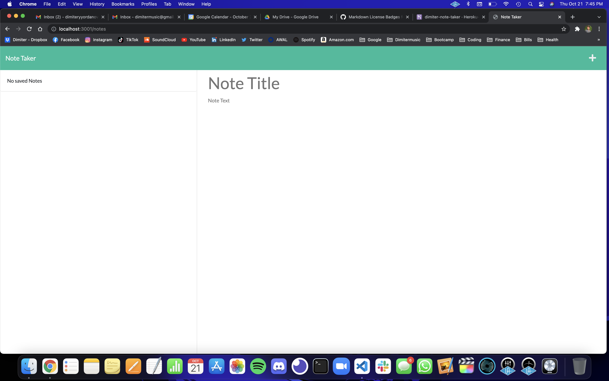

# Note Taker

## Description

This app creates notes with a title and description that the user inputs, saves them to the backend server with a unique Id, and keeps the user's notes on the page on refresh.

## Table of Contents
- [Note Taker](#note-taker)
  - [Description](#description)
  - [Table of Contents](#table-of-contents)
    - [Installation](#installation)
    - [Usage](#usage)
    - [License](#license)
    - [Contributing](#contributing)
    - [Questions](#questions)

### Installation

- Download folder
- Install Express
- Within the folder, run node `server.js`

### Usage

[https://dimiter-note-taker.herokuapp.com/](https://dimiter-note-taker.herokuapp.com/)

### License

WTFPL

### Contributing

[https://github.com/dimitermusic/note-taker](https://github.com/dimitermusic/note-taker)

### Questions

Github: [dimitermusic](https://www.github.com/dimitermusic)

Email: [dimitermusic@gmail.com](mailto:dimitermusic@gmail.com)

